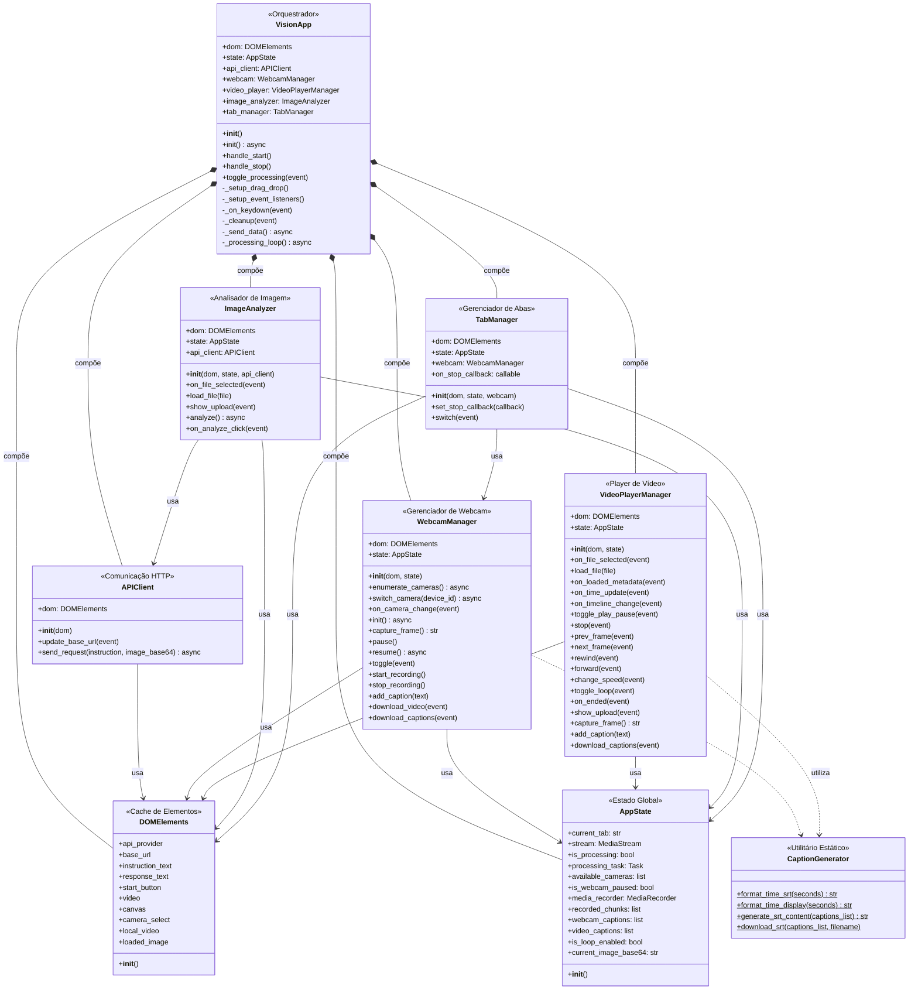
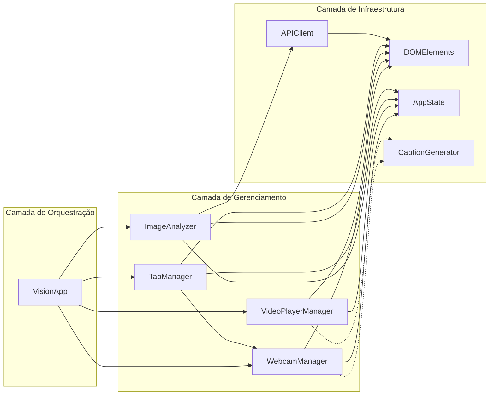

# Diagrama UML de Classes - Vision AI

Este documento apresenta o diagrama de classes da aplicação Vision AI.

## Visão Geral da Arquitetura

## Descrição das Classes

| Classe                 | Responsabilidade                                             | Padrão            |
| ---------------------- | ------------------------------------------------------------ | ----------------- |
| **VisionApp**          | Orquestra toda a aplicação, inicializa e conecta componentes | Façade/Compositor |
| **DOMElements**        | Cache centralizado de elementos HTML                         | Singleton-like    |
| **AppState**           | Estado global da aplicação                                   | State Pattern     |
| **APIClient**          | Comunicação HTTP com APIs de visão                           | Service           |
| **CaptionGenerator**   | Utilitários estáticos para legendas SRT                      | Utility Class     |
| **WebcamManager**      | Gerencia webcam, gravação e captura                          | Manager Pattern   |
| **VideoPlayerManager** | Controles de player de vídeo                                 | Manager Pattern   |
| **ImageAnalyzer**      | Upload e análise de imagens                                  | Service           |
| **TabManager**         | Navegação e lógica de abas                                   | Controller        |

## Fluxo de Dependências

## Legenda

- **Linha sólida (-->)**: Dependência forte (injeção de dependência)
- **Linha tracejada (..>)**: Uso ocasional (métodos estáticos)
- **Composição (\*--)**: VisionApp cria e gerencia as instâncias
